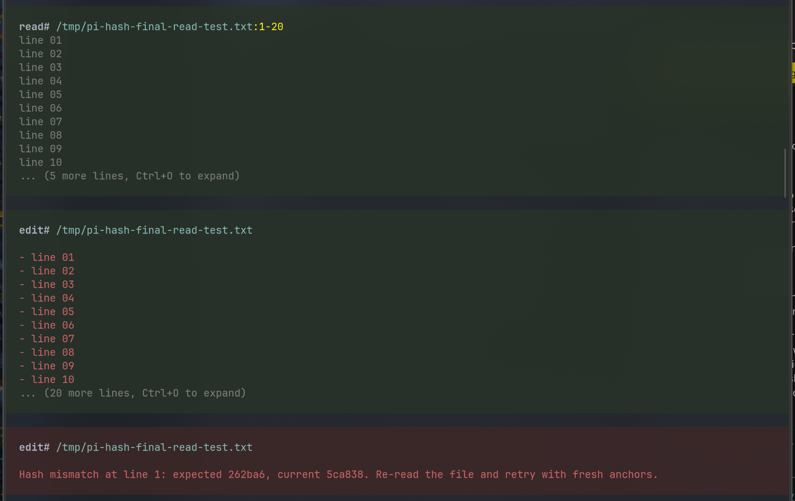

# Hash-Anchored Edit for Pi

Safer `read`/`edit` replacement tools for [Pi](https://pi.dev/) coding agent. Each line returned by `read` includes a short SHA-256 content hash, and every `edit` must present the matching line number + hash before the file is written.



## Why this exists

Agentic coding often fails because context goes stale: line numbers drift, exact text snippets are duplicated, or another edit changes the file between `read` and `edit`. This package adds a lightweight optimistic-concurrency check to file edits:

1. `read` returns `LINE#HASH | content` anchors.
2. The model sends those anchors back to `edit`.
3. `edit` re-reads the file and verifies every hash against current content.
4. Any mismatch aborts the whole edit, forcing a fresh read instead of risking the wrong write.

## Install

```bash
pi install npm:pi-hash-anchored-edit
```

Or install from GitHub:

```bash
pi install git:github.com/Fadouse/pi-hash-anchored-edit
```

The extension intentionally registers tools named `read` and `edit`. Pi gives extension tools priority over built-ins with the same name, so normal model calls automatically use these safer implementations.

## Read output

`read` returns every editable text line as:

```text
000001#a1b2c3 | const value = 1;
```

- `000001` is the real 1-based line number.
- `a1b2c3` is `sha256(lineContent).slice(0, 6)`.
- The hash is computed without the newline character.

The raw tool result keeps anchors for the model. The Pi TUI hides anchor noise in collapsed previews and supports Ctrl+O expansion, matching the default Pi read experience.

## Edit schema

```json
{
  "path": "src/file.ts",
  "edits": [
    {
      "line": 12,
      "hash": "a1b2c3",
      "mode": "patch",
      "oldText": "1",
      "newText": "2"
    }
  ]
}
```

Each edit is validated against the original file content before any write happens.

## Edit modes

- `patch` — replace `oldText` with `newText` inside the anchored line. `oldText` must occur exactly once and both strings must be single-line. Best for small token-efficient changes.
- `replace` — replace the anchored line with `newText`. `newText` may contain multiple lines.
- `delete` — delete the anchored line.
- `insert_before` — insert `newText` before the anchored line.
- `insert_after` — insert `newText` after the anchored line.

Example small patch:

```json
{
  "path": "example.txt",
  "edits": [
    { "line": 1, "hash": "dccb66", "mode": "patch", "oldText": "I", "newText": "he" }
  ]
}
```

Turns:

```text
test I like you
```

into:

```text
test he like you
```

without sending the whole replacement line.

## TUI behavior

- `read` shows a 10-line preview by default and Ctrl+O expands the full result.
- `read` mirrors Pi's `:start-end` range display when `offset`/`limit` are used.
- successful `edit` shows only a colored diff in a green edit block.
- failed `edit` shows the error message inside a red edit block.
- raw results still include updated anchors for the model, so follow-up edits can continue without re-reading the whole file.

## Safety rules

- Every edit must include `line` and `hash`.
- Hash mismatches abort the whole edit.
- Multiple edits for the same line are rejected.
- `patch.oldText` must occur exactly once on the anchored line.
- Edits are validated against the original file, then applied bottom-up.
- Existing line endings and final newline style are preserved.
- Binary/image files are not inlined.

## Command

```text
/hash-edit-status
```

Shows whether the extension is loaded and which hash length is active.

## Development

```bash
npm install
npx tsx -e "import('./index.ts').then(() => console.log('ok'))"
```

## License

MIT
